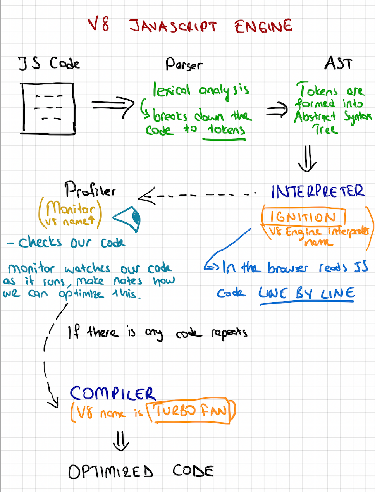
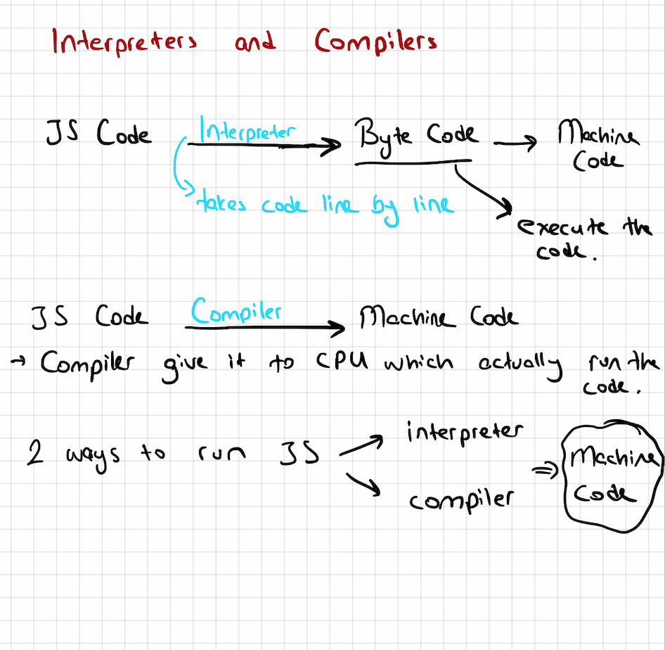
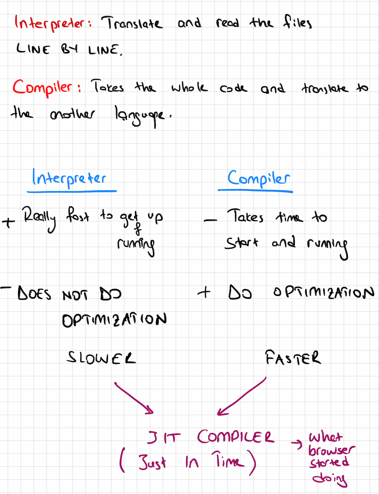
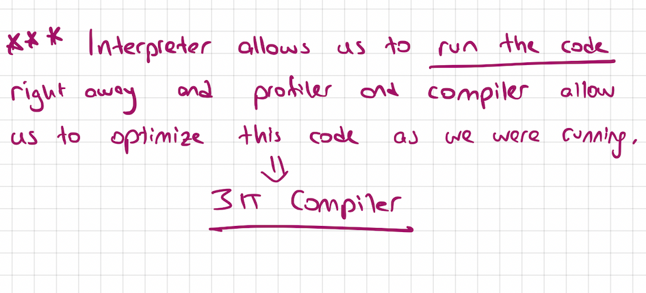
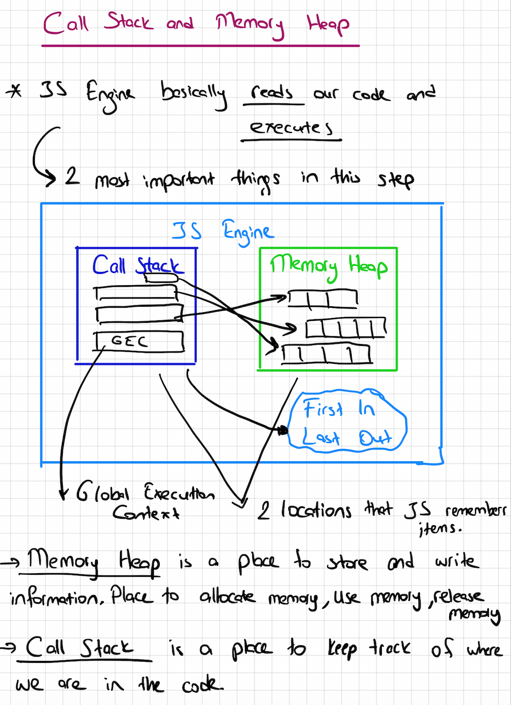
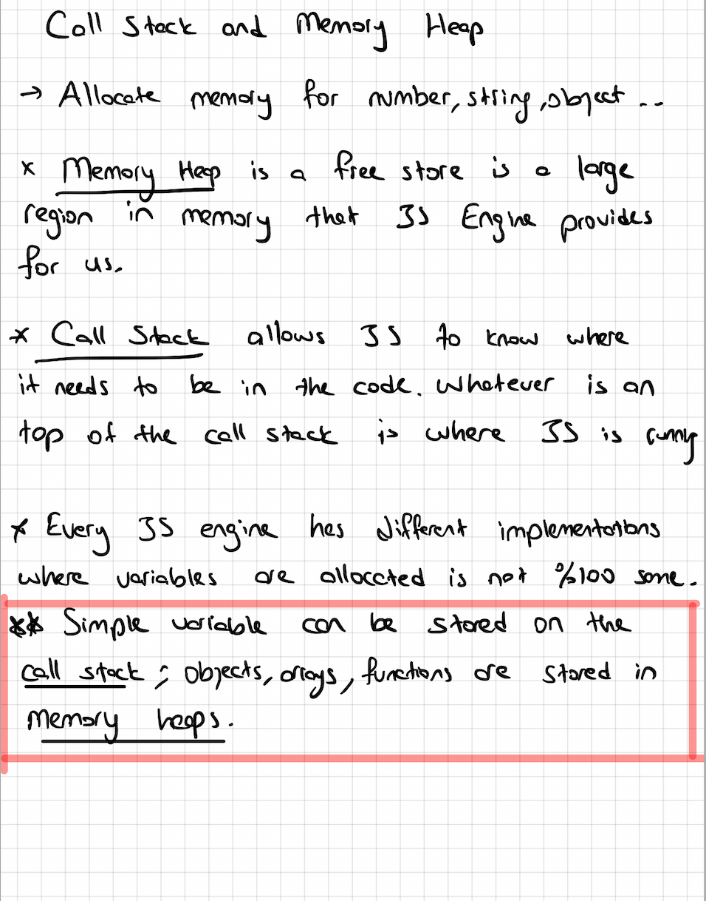

# js-foundation

# JS Engine
* JS is single threaded language which uses callback queue.
*  Computer can only understand ones and zeros. Computer does not know what is JS file so V8 engine understands JS, it reads our code and then it runs this code.
*  Thanks to the JS Engine which was found by Brendan Eich(SpiderMonkey for Firefox), we are able to run the code on a browser, previously could only read HTML and CSS.

* JS File        ->         JS Engine        ->          Computer

*  JS Engine understand the JS file and tell the computer what to do(translator)

# Inside the JS Engine:

* JS engine can be built by anybody but it is a lot of work. V8 engine which was built by Google is the fastest and is written in C++ which is low level programming language.
* If everybody creates its own JS, it would be a total chaos which is why ECMAScript was created. It defines the standard of JS engines and how it should work. ECMAScript is a governing body of a JS that essentially decides how the language should be standardized.
* Once we understand JS engine principles and why it’s built the way, we will able to write OPTIMIZED CODE.

# Interpreters and Compilers

* There are 2 ways to run JS using an interpreter or a compiler.

* In programming, there are generally 2 ways of translating to machine language or something that our computers can understand. It applies to most programming languages like JS, Python, Java, C++. They all use some of these concepts.

Interpreter: Translation happens LINE BY LINE on the fly.

Compiler: DOES NOT TRANSLATE ON THE FLY.  Compilers work a head of time to create a translation of what code we have written and compiles down to usually a language that can be understood by machines.
* It basically takes the WHOLE CODE and try to understand what code does. Then, it takes the program in JS or ay type of language and WRITE A NEW PROGRAM IN A NEW LANGUAGE that computer can understand.

* Interpreters start translating their first line and runs the code for us. An interpreter is a natural fit for something like JS. JS originally was created for the browser.
* Compiler takes little bit longer to start up because it has to go to compilation step at the beginning. Go through our code, understand it and spit it out into another language. Compiler does not need to repeat the translation for each pass through so the edits that compilers do are called OPTIMIZATION

* BABEL is a JS compiler that makes your modern JS code and returns browser compatible JS(older JS)
* TYPESCRIPT is a superset of a JS that compiles down to JS.
* Both of these do what compilers do: TAKE ONE LANGUAGE AND CONVERT INTO A DIFFERENT ONE!

WRITING OPTIMIZED CODE/ EFFICIENT CODE:
* We want to write code in a way that helps compiler make the optimization.
* Paramater restructuring is best way to not use arguments in the function which might deoptimized code!
* For in loop could be problematic for iterating objects so USE Object.keys()
* delete keyword in JS could be problematic.
* eval()
* With 

Hidden classes
Inline caching  is done by compiler

# Optimization takeaways
1. Always instantiate your object properties in the same order so that hidden classes, and subsequently optimized code, can be shared.
2. Adding properties to an object after instantiation will force a hidden class change and slow down any methods that were optimized for the previous hidden class. Instead, assign all of an object’s properties in its constructor.
3. Code that executes the same method repeatedly will run faster than code that executes many different methods only once (due to inline caching).

# WebAssembly
WebAssembly have the standard binary executable format.
WebAssembly is a way to take code in any programming language and run it within a web browser.
- It runs really really fast on the browser instead of going through the entire JS engine process. Might be game changer in the future.

# Call Stack and Memory Heap
* JS Engine basically reads our code and executes it.
* Call Stack is a region in memory which operates in FIRST IN LAST OUT mode.
* Call stacks stores functions and variables as your code executes at each entry state of the stack also called stack frame which allows us to know where we are in the code and it runs in FIRST IN LAST OUT mode.
* We use memory heap to actually point to different variables and objects that we store so that we know where to look.
* Call Stack stores only functions which are pushed into it.
Variables are stored in memory heap directly.

# Stack Overflow: 
Maximum stack size exceeded warning pops up instead of crashing the browser. 
1. Recursion
2. A lot of function is nested each other

# Garbage Collection: 
JS is a garbage collected language that means when js allocates memory like within a function we create an object and that object gets stored somewhere in memory heap automatically with JS when we finish calling the function and let’s say we don’t need that object anymore. It is going to clean it up for us.

JS automatically frees up the memory that we no longer use and will collect our garbage.

* In JS, garbage collector freeze memory on the heap and prevents memory leaks that is when the memory gets too big until it reaches maximum size. (Mark and Sweep Algorithm)

## Types in JS

* In programming, there are 2 types of languages: dynamically and statically typed languages.

# JS Types
1. Numbers
2. Boolean
3. String
4. Undefined    ==> absence of definition. It is used as the default value when the JS engine initialize our variables.
5. Null     ==> absence of value
6. Symbol('hello')   => created with ES6, mostly use for object properties so that object property is unique.
7. {}

* typeof operator in JS tells us the type of the item.
typeof true
typeof null
typeof {}

* Arrays and Functions are OBJECT!
* We can add a property to a function just like we can do with an object with a dot notation.

function a(){
    return 'hello'
}

a.name = 'ipek'
console.log(a.name)

* In JS, there are primitive and non primitive types.

Primitive Type: It is a data that only represents a single value so that means primitive type directly contains the value of that type.

Built-in objects with come with JS. Primitive types can create a wrapper object around this primitive value.

true.toString()   // 'true'
* Primitive types are always primitives but to chain different methods, they can create a wrapper object.

* Arrays are objects in JS. typeof []  // object
- To test if that is array:
 Array.isArray([1,2,3])  //true
 Array.isArray({1,2,3})  //false

 # Pass By Reference vs Pass By Value
 * Primitive types are immutable. We can't really change them. In order to change them, we need to completely remove the primitive type.  =>Pass by value: copy the value and create that value somewhere else in memory.

 * Objects in JS are stored in memory and are passed by reference which means that we don't copy the values like we did with primitive types.

* Having an object helps saving space in memory. Not copying and cloning the object.

concat() method

* Each object gets passed by reference.

## SUMMARY

# hoisting

* Any variable declaration are assigned a default value of undefined during the creation phase of execution context and this term is hoisting.

* Function Execution Context: It is created whenever function is invoked.

# scope

* Where variables are accessible.
& Current execution context.
* If JS engine can't find a variable in local(like function's execution context), it will look to the nearest parent execution context for the variable. That lookup process will continue all the way up, until the engine reaches the global execution context. In that case, if the global execution context does not have the variable, then it will throw a ReferenceError, because that variable does not exist anywhere up the scope chain or the execution context chain.

# closure scope

# this
* 'this' is the object that function is property of
*  Methods are functions that are inside of objects so the property methods can be accessed with dot notation.
* Whatever to the left of the dot which is the object that the function is a property of.

2 main benefits of using 'this'
 1. gives methods access to their object
 2. execute same code for multiple objects

 * this ==> It matters HOW THE FUNCTION WAS CALLED not where it is written like lexical scope.

* Everything in JS is actually lexical scoped how you write, it determines what we have available except THIS keyword

* 'this' keyword is DYNAMICALLY SCOPED so HOW THE FUNCTION WAS CALLED is the matter!

*
    How we can solve this?

    Arrow functions are LEXICALLY bound so they have lexical behaviour.